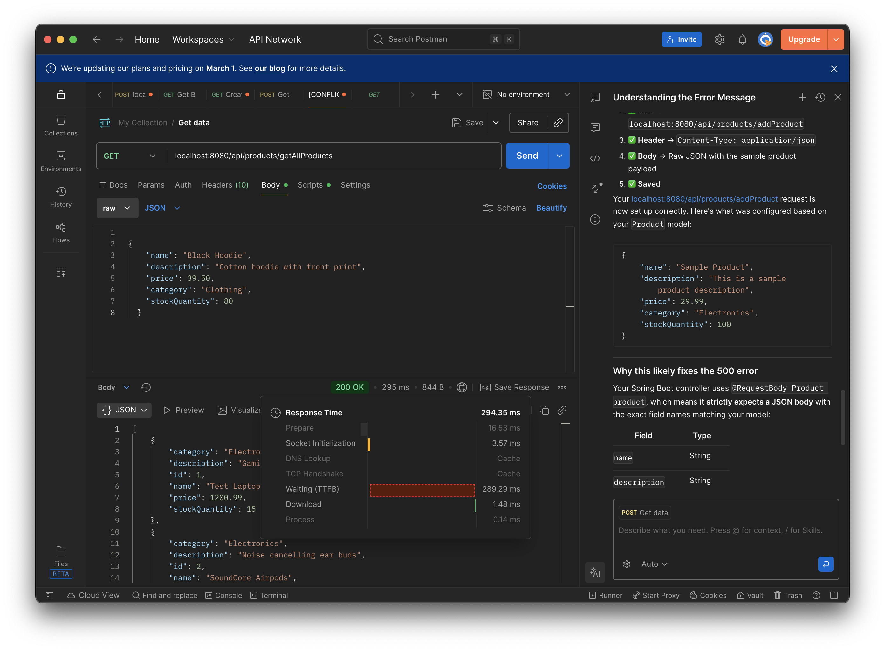
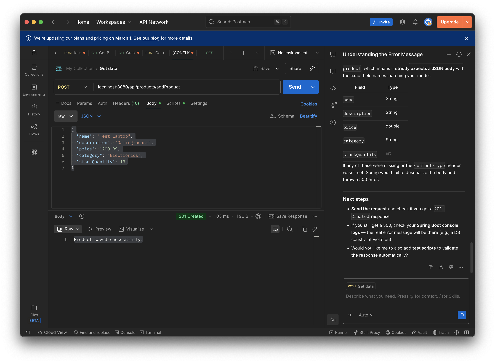
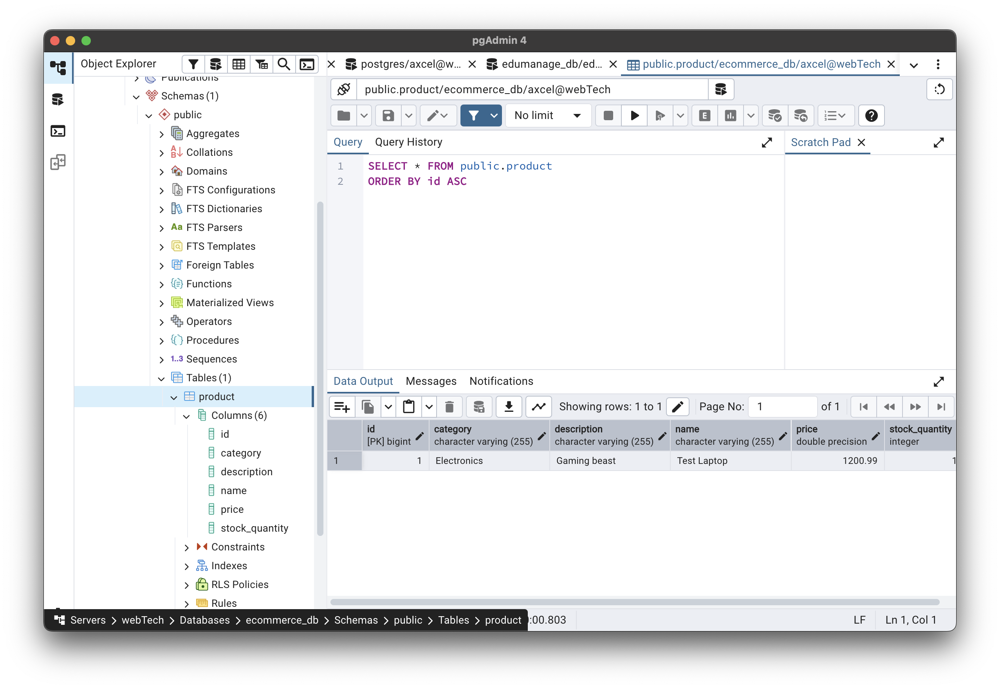
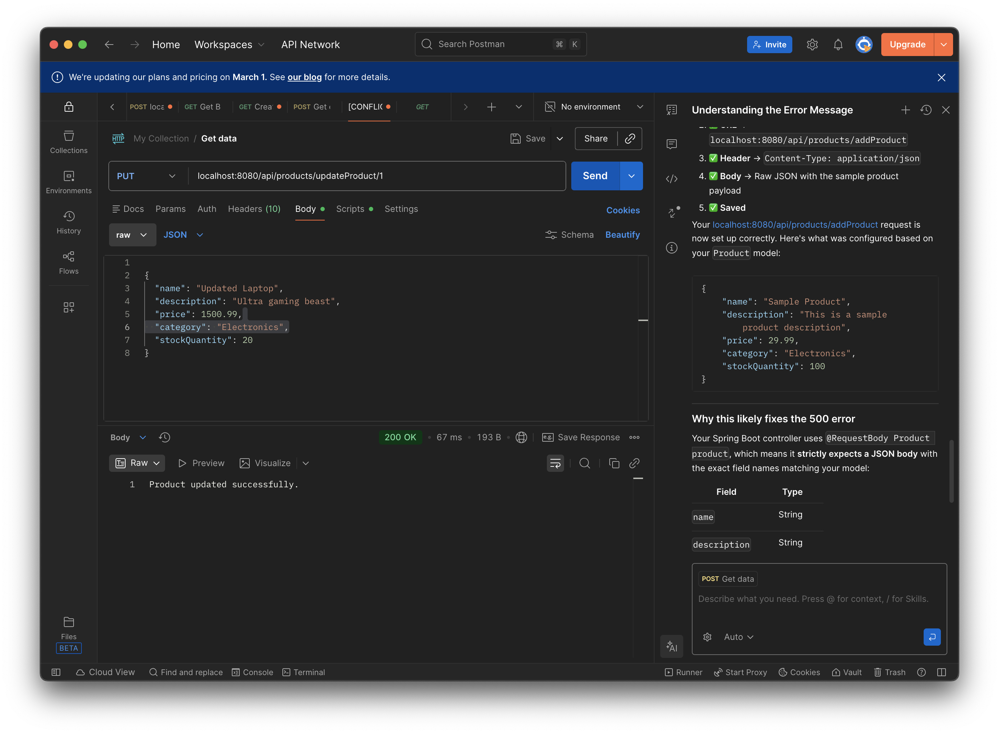
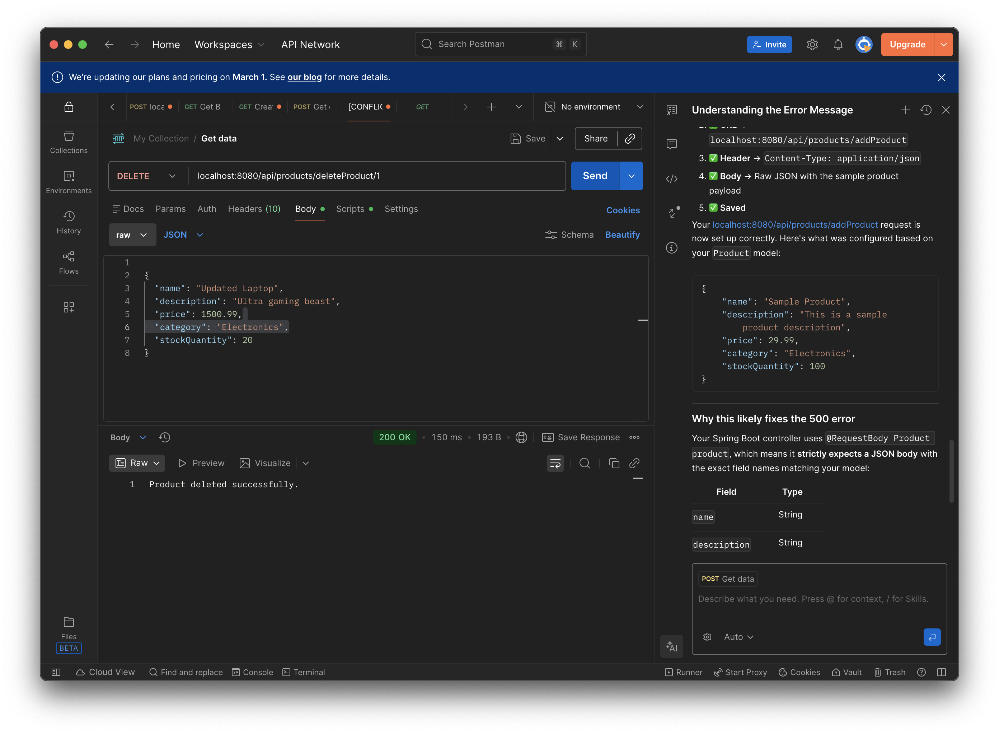

# E-Commerce CRUD API Assignment

## Endpoints
- GET /api/products/getAllProducts → all products
- GET /api/products/getProduct/{id} → single product
- POST /api/products/addProduct → create new
- PATCH /api/products/updateProduct/{id} → update product
- DELETE /api/products/{id} → delete

### Database
Connected to PostgreSQL (JPA + Hibernate)

### Screenshots (Postman, pg Admin tests)

**GET /api/products - Fetching all products from DB**

**Creating a new product (201 Created)**

**PostgreSQL Table after POST - New product saved**

**Updating product details (200 OK)**

 **Deleting a product (204 No Content)**

